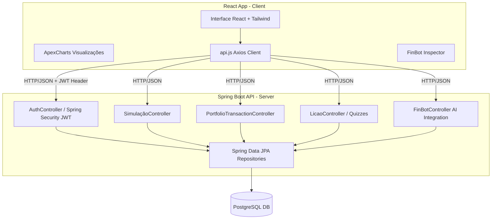

# Visão Geral do Sistema — EduFinance

O **EduFinance** é uma plataforma gamificada de educação financeira projetada para ajudar estudantes e jovens adultos a aprenderem conceitos de finanças pessoais, simulação de investimentos e negociação no mercado de ações de forma prática e divertida.

---

## 🏗️ Arquitetura do Sistema

O sistema é construído sobre uma arquitetura cliente-servidor (decoupled), com uma separação clara entre a interface do usuário (Frontend) e a lógica de negócios e persistência (Backend).

---

## 🛠️ Stack Tecnológica

### Frontend (Cliente)
*   **React 19 & Vite:** Framework ultra-rápido para construção de Single Page Applications (SPA).
*   **TailwindCSS (v4):** Estilização moderna e responsiva baseada em utilitários.
*   **ApexCharts & React-ApexCharts:** Gráficos interativos modernos para projeções financeiras (Área, Donut e Linha/Sparklines).
*   **Lucide React:** Pacote de ícones minimalistas e consistentes.
*   **Axios:** Cliente HTTP para comunicação com a API Restful.

### Backend (Servidor)
*   **Java 21 & Spring Boot 3.3.5:** Robustez e alta performance para APIs corporativas.
*   **Spring Data JPA / Hibernate:** Abstração e mapeamento objeto-relacional (ORM).
*   **Spring Security & JWT (JSON Web Tokens):** Controle de acesso e autenticação stateless segura.
*   **OpenAPI / Springdoc (Swagger):** Documentação automática de endpoints da API.
*   **Lombok:** Redução de boilerplate (Getters/Setters automáticos).

### Banco de Dados & Serviços
*   **PostgreSQL:** Banco de dados relacional robusto e escalável.
*   **Integração IA (FinBot):** Modelo LLM integrado para fornecer explicações contextuais de economia.

---

## 🌟 Funcionalidades e Fluxos Principais

### 1. Trilha de Aprendizado Gamificada (Estilo Duolingo)
*   **Aulas & Quizzes:** O usuário avança por módulos teóricos rápidos seguidos de perguntas de múltipla escolha.
*   **Recompensas (XP & Níveis):** Responder corretamente gera XP. Acumular 100 XP sobe o nível do usuário.
*   **Badges (Medalhas):** Desbloqueio automático de conquistas (ex: "Primeira Aula", "Simulador Pro") ao atingir marcos históricos.

### 2. Simulador de Investimentos (Juros Compostos)
*   **Visualização Gráfica:** Gráfico de **Área interativo** mostrando a evolução patrimonial mês a mês.
*   **Investido vs. Rendido:** Separação visual clara do dinheiro aportado pelo usuário do crescimento exponencial gerado pelos juros.
*   **Conversão para Saldo Virtual:** Ao rodar uma simulação de sucesso, o saldo virtual do usuário é atualizado no banco de dados.

### 3. Mercado de Ações Simulado & Carteira
*   **Oscilações de Mercado:** Cotações que oscilam em tempo real a cada 6 segundos via simulação determinística.
*   **Gráficos Rápidos (Sparklines):** Cada card de ativo possui um gráfico miniatura de tendência. O modal de compra/venda exibe um histórico simulado detalhado de 30 dias.
*   **Gráfico Donut de Carteira:** Visualiza a diversificação e alocação do patrimônio atual em ações de forma interativa.
*   **Histórico de Transações:** Registro completo de operações de compra e venda com preço médio ponderado.

### 4. FinBot & Inspector (Educação Assistida)
*   **FinBot:** Chatbot interativo para tirar dúvidas de mercado em tempo real.
*   **FinBot Inspector:** Botão flutuante global que permite ao usuário clicar em qualquer elemento da tela para receber uma explicação simplificada da IA sobre aquele card, campo ou estatística.

### 5. Customização Visual (Acessibilidade e Identidade)
*   **Temas Globais:** Escolha dinâmica de 7 paletas de cores através do painel de Perfil (aplicado instantaneamente via variáveis CSS globais).
*   **Dark Mode nativo:** Modo escuro completo para conforto visual.

---

## 💾 Modelo de Entidades (Banco de Dados)

1.  **Perfil (`perfis`):** Guarda o usuário, nível, XP atual, saldo virtual acumulado e credenciais criptografadas.
2.  **Licao (`licoes`) & Pergunta (`perguntas`):** Estruturação da trilha de estudo e banco de questões do quiz.
3.  **ProgressoUsuario (`progresso_usuario`):** Associa perfis às lições concluídas para gerenciar progresso individual.
4.  **Medalha (`medalhas`):** Conquistas e insígnias conquistadas pelos usuários.
5.  **Simulacao (`simulacoes`):** Histórico de projeções de investimentos geradas.
6.  **PortfolioTransaction (`portfolio_transactions`):** Histórico de transações de ativos negociados no mercado simulado.
